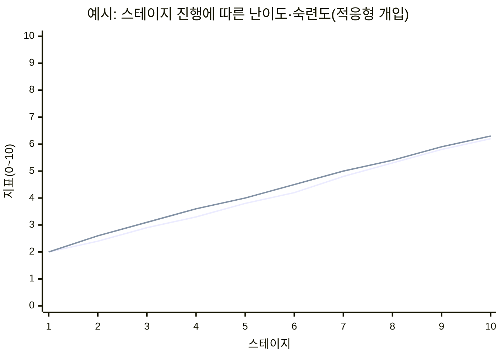
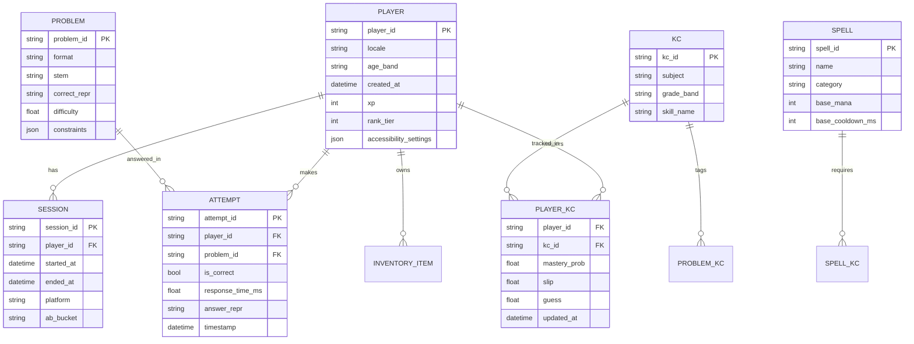

# 수학 답으로 마법을 시전하는 게임 개발을 위한 심층 연구 기반 개발 계획서

## Executive Summary

본 보고서는 “플레이어가 수학 문제의 답을 입력해 마법을 시전한다”는 핵심 아이디어를 **재미(몰입)·교육 효과(학습 전이)·차별화(시장 내 독자성)** 관점에서 실현하기 위한 **게임 디자인/학습 설계/기술 아키텍처/프로덕션 로드맵**을 단계별로 제시한다. 게임 기반 학습이 수학 학습태도·흥미·성취에 긍정적 기여를 할 수 있다는 국내 연구 결과와(특히 학습부진아 사례에서 흥미·자신감·태도 및 성취 향상)citeturn0search4turn0search8, 국내 AI 기반 적응형 학습 플랫폼의 교육 효과가 전반적으로 **중간 정도 효과크기**로 보고된 메타분석 결과를 바탕으로citeturn16view3, “문제-정답”을 단순 게이트로 쓰는 수준을 넘어 **학습 과학(테스팅 효과·피드백·간격 효과·교차 연습)과 동기 이론(자기결정성·플로우) 및 게임 디자인 프레임워크(MDA·DDA)**를 결합한 설계를 권장한다.citeturn2search3turn3search2turn3search0turn3search9turn2search1turn2search0turn4search0turn4search13

핵심 제안은 다음과 같다.

첫째, **전투의 ‘조작 부담’과 ‘학습 부담’을 분리**한다. 즉, 이동·회피는 단순 조작으로 유지하고, 마법 시전은 수학 입력으로 “짧고 강한 몰입 순간”을 만든다(과부하 방지). 인지부하 이론 관점에서 불필요한(외재적) 부하는 줄이고, 학습에 기여하는 부하는 유지한다.citeturn2search2

둘째, “난이도=실력”이 아니라 **난이도=전략 자원**이 되게 만든다. 쉬운 문제는 빠른 시전(짧은 쿨다운·낮은 마나), 어려운 문제는 강력 시전(딜/범위/상태이상/콤보 보너스)으로 연결해, 플레이어가 **상황에 따라 난이도 선택**을 하게 한다. 이는 플로우(능력-도전 균형)와 동기 유지에 유리하며citeturn2search0, 동적 난이도 조정(DDA) 설계 원칙에 의해 개인차를 흡수한다.citeturn4search13

셋째, 콘텐츠는 “단원”이 아니라 **지식요소(KC: Knowledge Component) 단위**로 설계하고, KC별 숙련도를 추정해 문제를 공급한다. 고전적 지식추적(knowledge tracing)은 숙련 확률을 업데이트하며(예: p(L0), p(T), p(G), p(S) 같은 파라미터)citeturn12view0, 국내 교육용 게임/게이미피케이션 연구에서 “이론 기반 설계 원리의 부족”이 지적된 점을 보완하는 방식이 된다.citeturn0search0turn0search22turn16view2

넷째, 접근성·보안·개인정보는 출시 이후가 아니라 **설계 초기부터 요구사항으로 고정**한다. 한국 국가표준(예: 모바일 앱 콘텐츠 접근성 지침 KS X 3253:2016의 19개 항목 구성 및 원칙 체계)citeturn8view0turn8view1과 웹 접근성 국가표준의 개정 흐름(기존 24개 검사항목에서 33개로 확장 등)을 참조해citeturn8view2turn7view1, 입력 UX를 포함한 전 구간에서 접근성을 달성한다. 개인정보는 「개인정보 보호법」의 목적과 기본 원칙을 준수하고citeturn6search22, 아동·청소년 대상 서비스라면 별도 안내서/가이드라인의 요구(법정대리인 동의 등)를 반영한다.citeturn6search20turn6search9

마지막으로, 본 계획서는 **프로토타입→버티컬 슬라이스→알파/베타→소프트런치→라이브옵스**로 이어지는 생산 체계를 포함하며, 학습 성과(정확도·숙련 추정치·전이 문제)와 게임 성과(리텐션·세션 길이·재방문) 지표를 함께 관리하는 운영/분석 체계를 제안한다.citeturn16view3turn3search2turn2search15

## Core Concept and Differentiation

핵심 차별화는 “수학 문제를 풀면 다음으로 넘어간다”가 아니라, **수학 입력이 곧 ‘마법 시전 행위’**가 되도록 **행동-피드백 루프**를 재설계하는 데 있다. 교육용 RPG로 널리 알려진 entity["video_game","Prodigy Math Game","educational math rpg"]은 “정답을 맞혀야 진행/보상을 얻는” 전형적 구조와 “adaptive learning”을 전면에 내세우며citeturn0search3turn0search15, entity["video_game","Kahoot! Algebra by DragonBox","math learning app"] 계열은 “학습인 줄 모르게 대수 개념을 익히게 한다”는 서사를 강조한다.citeturn5search0turn5search3 또한 고전 교육 게임인 entity["video_game","Math Blaster: Episode 1","sega genesis edutainment"]은 “정답 경로로 이동해 적을 무찌른다”는 형태로 문제-행동 매핑의 원형을 보여준다.citeturn5search20

본 기획이 차별화할 수 있는 지점은 다음 세 축이다.

첫째, **전술 선택이 곧 학습 선택**이 되게 만든다. 예: “지금은 방어가 급하니 분수/비율 기반 방어 주문(중간 난이도)을 선택” vs “보스 페이즈라서 연립/함수 기반 궁극기(고난이도)를 감행”. 단순히 ‘맞히면 보상’이 아니라 **문제 난이도·형식·주제의 선택이 전술 의사결정**으로 기능한다(교육 게임에서 외재적 보상/경쟁에 치우치면 내재적 동기의 지속에 한계가 있다는 문제의식과 정합).citeturn16view2

둘째, **“답” 중심이 아니라 “표현(expression)” 중심 입력을 확장**한다. 선택형만으로는 계산 속도·요령 게임에 수렴하기 쉽다. 식 입력/기호 입력/정신산·퍼즐을 혼합하면, 문제 해결 전략이 다양해지고 전이 가능성이 높아진다(교차 연습의 효과 및 선택 전략 필요성).citeturn3search9turn3search1

셋째, **적응형 학습이 “학습앱”처럼 보이지 않게 게임 시스템에 매립**된다. 학습 플랫폼 메타분석에서 나타난 중간 효과크기를 “게임 시스템화된 반복/피드백/간격 배치”로 끌어올리는 것이 목표다.citeturn16view3turn2search15turn3search0turn3search2

게임 디자인 관점에서는 MDA(Mechanics–Dynamics–Aesthetics) 프레임으로 목표 경험을 먼저 정의하고, 그 경험을 유발하는 메커닉을 역설계한다.citeturn4search0 본 게임이 노리는 핵심 미학(Aesthetics)은 “판타지 전투의 쾌감 + 지적 ‘해결’의 쾌감 + 성장(숙련) 체감”이며, 이를 유지하기 위한 난이도 조절은 DDA 연구에서 제시된 “플레이 경험을 해치지 않으면서 난이도를 조정하는 설계 요구”를 따른다.citeturn4search13turn2search0

## Game Design Specification

이 절은 “재미”를 만드는 구체 설계(플레이어 플로우, 조작, UI/UX, 문제→마법 매핑, 난이도·피드백, 접근성, 안티치트, 보상/밸런싱)를 **구현 가능한 수준**으로 정리한다.

### Player Flow

플레이 흐름은 “전투(짧은 루프)”와 “학습/성장(긴 루프)”를 분리하고, 서로를 강화하게 설계한다.

```mermaid
flowchart TD
  A[첫 실행] --> B[온보딩: 2분 내 핵심 조작+시전 경험]
  B --> C[진단 플레이: 짧은 10문항/3전투로 초기 숙련 추정]
  C --> D[허브: 장비/스킬트리/스펠북/연습장]
  D --> E[미션 선택: 스토리/도전/협동]
  E --> F[전투: 이동·회피 + 주문 시전(수학 입력)]
  F --> G{전투 결과}
  G -->|승리| H[보상: XP/재료/카드/스킬포인트]
  G -->|패배| I[리트라이: 힌트/연습 추천/난이도 조절]
  H --> J[리뷰: 오답 노트/재도전/간격 복습 예약]
  I --> D
  J --> D
```

이 구조는 “학습이 메인 화면에서 강요되는 느낌”을 줄이고, 전투 후 짧은 리뷰로 학습 루프를 닫는다. 피드백이 학습에 매우 강력한 영향을 줄 수 있으나(부정적 영향도 가능) 피드백의 수준과 타이밍이 중요하다는 점을 설계 전제로 삼는다.citeturn3search2

### Controls and Input UX

조작은 플랫폼별로 “이동·회피(상시)”와 “입력(시전 순간)”을 분리한다.

- **모바일**: 좌측 가상 스틱(이동) + 우측 회피/기본 행동. 주문 버튼을 누르면 하단에 수학 키패드/식 입력 UI가 슬라이드-업.  
- **PC**: WASD 이동, Space 회피, 숫자키로 주문 슬롯 선택 후 입력 오버레이에서 답 입력.  
- **태블릿/교실 모드**: 큰 버튼·큰 폰트·오타 복구 기능 강화(접근성). 모바일 접근성 국가표준은 운영체제/기기 한정 없이 적용 가능하도록 설계되었고, 인식·운용·이해·견고성의 원칙 체계로 항목을 제시한다.citeturn8view0turn8view1

#### 입력 방식 비교 표

| 입력 방식 | 장점(게임성/학습) | 단점/리스크 | 추천 사용 구간 | 부정행위(치트) 취약점 |
|---|---|---|---|---|
| 선택형(MCQ) | 빠르고 스트레스 낮음, 모바일 친화 | 찍기/운에 의존 가능(p(G)↑), 고난도 확장 한계 | 튜토리얼·난이도 하향 보호·속도전 주문 | 낮음~중간(스크립트 클릭) |
| 단답(숫자/문자) | 계산력·유창성 측정에 유리 | 오타/부호 실수 스트레스 | 연산·분수·기하 길이 계산 | 중간(자동 계산기) |
| 식 입력(키보드/에디터) | “표현” 학습, 대수/함수/증명에 확장 | UI 난이도↑, 인지부하↑ | 중상~상 난이도 주문, 궁극기 | 중간(복사/붙여넣기) |
| 기호/구조 입력(블록/드래그) | 어린 학습자 친화, 개념 시각화 | 고학년 확장 제한 | 저학년/도입, 드래곤박스식 접근과 유사 | 낮음 |
| 정신산/타이핑(속도전) | 몰입감, 반사 신경과 결합 | 불안/압박, 접근성 이슈 | 콤보/연타 주문, 한정 이벤트 | 낮음(서버 타임 기준) |
| 퍼즐/논리(다단계) | 전이·사고력, 다양성 확보 | 제작 비용↑, 채점 복잡 | 보스전/레이드/스토리 미션 | 낮음~중간 |

식 입력 UI는 오픈소스 수식 입력 컴포넌트가 제공하는 가상 키보드/스크린리더 지원 등을 활용할 수 있다(웹 컴포넌트 기반 수학 입력·표시 및 접근성 지원을 명시).citeturn4search3turn4search7 또한 웹용 수식 편집기는 “타이핑이 쉽고 아름답게”라는 목표를 내세우며 수식 입력 UX를 표준화한다.citeturn4search2

### UI/UX: “마법”과 “수학”의 결합을 자연스럽게 보이게 하는 법

UI/UX 목표는 **수학 입력이 ‘문제 풀이 화면 전환’이 아니라 ‘주문 시전의 연출’로 지각**되게 만드는 것이다.

- **다이제틱(diegetic) 입력**: 입력 패널을 “룬 서클”로 표현하고, 입력한 수식이 룬으로 변환되어 회전/점등.  
- **즉시 피드백(미시)**: 입력 중에도 단위/부호/괄호 오류를 “마법 불안정(unstable)” 표시로 알려주되, 학습을 해치지 않게 과도한 힌트는 제한(피드백이 학습에 강력하지만 설계에 따라 역효과 가능).citeturn3search2  
- **전투 피드백(거시)**: 정답 시 데미지/상태이상/보호막 수치가 즉시 반영되고, 오답 시 “작은 패널티 + 재시도 기회”로 좌절을 줄인다(플로우 유지).citeturn2search0turn4search13  
- **인지부하 관리**: 전투 화면에 정보 과밀을 피하고, 오버레이는 짧게 등장·즉시 사라지게 설계(외재적 인지부하 최소화).citeturn2search2

image_group{"layout":"carousel","aspect_ratio":"16:9","query":["fantasy spellcasting UI overlay mockup","mobile RPG battle HUD clean UI","math game interface equation input overlay","educational game UI math spell casting"],"num_per_query":1}

### Math-Problem-to-Magic Mapping 설계

“문제 유형이 곧 주문 속성”이 되면 학습 목표와 게임 전술이 결합된다. 권장 매핑 방식은 **KC(지식요소) ↔ 주문 효과 파라미터**를 연결하는 것이다.

- **공격 주문(정확도·속도 중심)**: 사칙연산/곱셈/정신산 → “초당 시전 가능(낮은 쿨다운)” / 정답 시 콤보.  
- **방어 주문(개념 이해 중심)**: 분수·비율·단위 변환 → “보호막 비율 계산” / 오답 시 약화.  
- **제어 주문(표현/대수 중심)**: 식의 간단화·방정식 풀이 → “상태이상 확률/지속 시간” 증가.  
- **소환/지형 변경(공간 감각)**: 기하/좌표/각도 → “범위·형상”이 정답 품질에 의해 결정.  
- **궁극기(프로젝트/퍼즐)**: 문장제·다단계 퍼즐 → 큰 보상, 길고 희귀하게.

이때 단순 정오 채점만 쓰면 “찍기”가 우회로가 되므로, 지식추적 모델이 전제하는 **추측(guess)·실수(slip)**를 시스템적으로 다룬다. 예를 들어 선택형은 guess 확률이 상대적으로 커질 수 있으므로(모델 파라미터 p(G) 존재)citeturn12view0, 전투 내 보상/효과를 조정하거나 추가 확인 입력(짧은 단답)을 붙여 신뢰도를 올린다.

### Difficulty Scaling: 플로우 곡선 유지 + 학습 곡선 유지

난이도는 두 층으로 나눠야 한다.

- **전투 난이도(적 AI/패턴)**: DDA로 조절. DDA 연구는 효과적 조정이 “핵심 경험을 깨지 않고” 이루어져야 한다고 강조한다.citeturn4search13  
- **문제 난이도(학습 난이도)**: 학습 모델(지식추적/IRT/정답률 예측)로 조절. 학습 플랫폼 연구에서도 적응형 접근이 일정 효과를 보였으나 연구 간 이질성이 높고 조절변인에 따라 차이가 크므로, 실측 기반 튜닝이 필수다.citeturn16view3

플로우 이론은 “과제가 너무 쉽거나 너무 어려우면 몰입이 깨진다”는 경험적 관찰을 제공한다.citeturn2search0 따라서 “예상 정답률 60~85%” 구간을 **기본 목표 대역**으로 두고(실험으로 조정), 이탈 시 난이도·힌트·시간 제한을 완화/강화한다.



### Feedback, Reward, and Balancing

학습 설계 관점에서 “문제 풀이”는 곧 **연습 시험(테스팅)**이며, 장기 기억 향상을 유발할 수 있다.citeturn2search15turn2search11 따라서 전투의 재미를 해치지 않는 범위에서 **짧은 회상(retrieval) 기회**를 반복 제공하는 것이 핵심이다.

게임 밸런싱은 “정답=보상”을 넘어 다음 규칙을 권장한다.

- **XP/재화는 (정답 여부)×(문제 난이도/복잡도)×(숙련 공백)**에 비례.  
- **쿨다운/마나**: 쉬운 입력은 빠르되 약하고, 어려운 입력은 느리되 강력.  
- **콤보 시스템**: 연속 정답으로 콤보 게이지 상승(속도전), 단 “실력 격차”가 좌절로 이어지지 않게 DDA 보호막 제공.  
- **오답 패널티**: “죽음”보다는 “시전 실패/약화/마나 낭비” 정도로 제한, 재시도나 힌트 루트를 제공(피드백이 부정적 동기로 전환되는 것을 방지).citeturn3search2turn2search1

### Accessibility and Safety-by-Design

접근성은 입력 UX에서 가장 많이 무너진다. 모바일 앱 콘텐츠 접근성 국가표준은 19개 항목을 제시하고, 인식·운용·이해·견고성 범주로 접근성 구현을 요구한다.citeturn8view0turn8view1 또한 웹 접근성 국가표준은 개정 흐름 속에서 검사항목이 확대되었고, “입력 방식 지원/레이블과 네임/동작 기반 작동” 등 입력 관련 요구가 명시적으로 강화된다.citeturn8view2turn7view1

게임에 바로 매핑하면 다음이 핵심 체크리스트가 된다.

- **실시간 전투 중 ‘시간 제한’ 완화 옵션**: 광과민성/긴장 유발을 줄이고, 충분한 시간 제공.citeturn8view1turn7view1  
- **색각 이상 대비**: 속성 색/룬 색에 의존하지 않고 아이콘·패턴·텍스트 병행.  
- **스크린리더/음성 안내**: 문제 읽기(TTS), 입력 확인(“x의 값은?”), 정답/오답 피드백.  
- **입력 대체 수단**: 식 입력이 어려운 사용자에게 ‘구조 블록 입력’ 또는 ‘단계형 입력’ 제공.

## Math Content and Adaptive Learning System

이 절은 “무슨 수학을, 어떤 형태로, 어떤 알고리즘으로, 어떻게 단계적으로 제공할지”를 제시한다. 국내 연구에서는 수학 학습의 정의적 영역(흥미/자신감) 개선 필요성이 반복적으로 제기되며, 자기결정성 이론 기반 설계 원리 도출 및 적용이 내재적 동기 향상에 유의미한 결과를 보였다는 보고가 있다.citeturn16view2 따라서 콘텐츠는 “정답 맞히기”가 아니라 **자율성(선택), 유능감(성장 체감), 관계성(협동/공유)**을 자극하도록 구성한다.citeturn2search1turn16view2

### 문제 유형: 주제(Topics) × 형식(Formats) 매트릭스

문제 은행은 “단원/학년”만이 아니라 “지식요소(KC)”로 태깅하고, 한 KC가 여러 형식으로 출제되게 설계한다(전이 강화). 교차 연습(섞어서 풀기)은 수학 학습에서 장기 성취에 유리하다는 연구가 있으며citeturn3search9turn3search33, 이는 게임에서 “다양한 주문을 섞어 쓰는 전투”와 자연스럽게 결합할 수 있다.

#### 문제 유형 비교 표

| 구분 | 예시 주제 | 대표 형식 | 교육적 강점 | 게임 적용 포인트 |
|---|---|---|---|---|
| 연산/유창성 | 덧셈·뺄셈·곱셈·나눗셈 | 정신산, 단답, 속도전 | 자동화·기초 체력 | 콤보/연사 주문 |
| 분수·비율·단위 | 분수 연산, 비율, 단위 변환 | 단답, 단계형, 매칭 | 오개념 교정 | 방어막/버프 |
| 대수(초/중) | 1차 방정식, 식의 값 | 식 입력, 기호 입력 | 표현/조작 능력 | 제어/디버프 |
| 함수·그래프 | 좌표, 함수값, 변화율 | 선택형+간단 입력 | 해석·연결 | 지형/장판 |
| 기하 | 각도, 도형 성질, 넓이/부피 | 단답, 구성 퍼즐 | 공간 추론 | 소환/범위 |
| 확률·통계 | 경우의 수, 평균 | 선택형, 퍼즐 | 판단/모델링 | 예측/행운 주문 |
| 논리·퍼즐 | 수열, 규칙 찾기 | 퍼즐, 다단계 | 전이/사고력 | 보스 기믹 |

### 난이도 진행: 레벨 디자인과 학습 디자인의 동기화

난이도 진행은 “스테이지가 올라가면 어려워진다”로 끝나면 실패한다. 다음 3축을 동시에 올려야 한다.

- **인지 복잡도**: 한 문제에 포함된 요소 수(스웰러의 인지부하 관점에서 요소 상호작용이 증가하면 난이도가 상승).citeturn2search2  
- **표현 복잡도**: 단답 → 식 → 다단계 서술/퍼즐.  
- **전투 압력**: 시간 압박/적 패턴/실수 비용을 점진적으로 증가(DDA로 완충).citeturn4search13turn2search0

또한 학습 효율 측면에서 **간격 반복(spacing)**이 장기 유지에 유리하다는 메타분석 근거가 있으므로citeturn3search0turn3search16, “신규 KC 도입 → 짧은 반복 → 며칠 후 복습”을 게임 퀘스트/일일 보상과 연결한다.

### 적응형 알고리즘: 실전 구현용 3단계 로드맵

국내 적응형 학습 플랫폼 메타분석은 PRISMA 기준에 따라 연구를 선별했고, 사전/사후 및 통제/처치 연구에서 중간 정도 효과를 보고했다.citeturn16view3 하지만 “어떤 적응 로직이 어떤 상황에서 작동하는지”는 제품 맥락에서 검증이 필요하다. 이에 따라 알고리즘을 **단계적으로 고도화**한다.

#### 단계 A: 규칙 기반(MVP)
- 최근 10문항 정확도/반응시간으로 난이도 ±1 조정  
- 오답이면 같은 KC를 더 쉬운 형식으로 재출제(힌트 포함)  
- 3연속 정답이면 상위 난이도 또는 다른 KC로 전환(교차 연습)citeturn3search9

#### 단계 B: 지식추적(BKT) 기반(알파)
지식추적은 학습자의 정오답 기록으로 “알고 있을 확률”을 업데이트한다. 고전 모델에서는 초기 숙련(p(L0)), 학습 전이(p(T)), 추측(p(G)), 실수(p(S)) 같은 파라미터를 사용한다.citeturn12view0  
- KC별 숙련 확률 θ_k를 유지  
- 다음 문제 선택: **θ_k가 낮지만(학습 필요) 성공 가능성이 있는** KC를 우선  
- 예측 성공확률을 0.6~0.85 대역으로 유지(플로우/좌절 균형)citeturn2search0turn4search13

#### 단계 C: 하이브리드(IRT/밴딧 + BKT)(베타~라이브)
- 아이템 난이도 파라미터(IRT 유사) + BKT 숙련 + 탐색/활용(Thompson Sampling 등)을 결합  
- 목표함수: (학습 이득 추정) + (이탈 위험 최소화) + (콘텐츠 다양성)  
- 메타분석이 지적한 이질성(대상·출판형식·규모에 따라 효과 차이)을 제품 분석으로 해소citeturn16view3

### 레벨별 문제 예시

아래 예시는 “형식 다양성”을 보여주기 위한 샘플이며, 실제 구현에서는 NCIC/교육과정 고시 체계에 맞춰 KC 태그를 구성한다. 한국의 2022 개정 교육과정은 교육부 고시로 공표되며, 수학과 교육과정은 별책 형태로 제시된다.citeturn18view4turn15search7

**초급(레벨 1: 온보딩/유창성)**
- (선택형) 8+7 = ? ①14 ②15 ③16 ④17  
- (단답) 30−12 = ___  
- (정신산) 6×3 = ___ (5초 안)  

**초중급(레벨 2: 분수/단위의 도입)**
- (단답) 1/2 + 1/4 = ___  
- (매칭) “0.75 ↔ 3/4” 연결  
- (퍼즐) “물약 300mL의 2/3만 남았다. 남은 양?”  

**중급(레벨 3: 1차 방정식/식의 값)**
- (식 입력) 3x+5=20, x=?  
- (단답) x=4일 때 2x−1 = ___  
- (선택형) “전개 결과가 같은 식은?”  

**중상급(레벨 4: 비율·함수/그래프 해석)**
- (선택형+단답) 좌표 (2,3)이 y= x+1 위에 있는가? (예/아니오)  
- (단답) y=2x에서 x=5일 때 y=?  
- (퍼즐) “세 장판 중 안전한 장판은 ‘증가율이 가장 작은 함수’”  

**상급(레벨 5: 다단계/문장제/전이)**
- (다단계) “상자 A에는 공 4개, B에는 6개. 두 상자에서 1개씩 꺼낼 때 같은 색일 확률…”  
- (식 입력) “(x^2−1)/(x−1)”을 간단히 하라(단, x≠1).  
- (퍼즐) “조건을 만족하는 수열의 다음 항 찾기(패턴+증명 힌트)”

학습 효과를 강화하려면, 정답 후에도 짧은 “왜 그런지” 피드백(개념/전략 수준)을 제공하고, 오답 후에는 “정답 제공”보다 “정정 가능한 힌트”를 제공하는 것이 바람직하다(피드백 수준의 중요성).citeturn3search2

## Technical Architecture and Data Models

본 절은 클라이언트/서버/DB/수학 엔진/입력 파서/보안/분석까지 **구현 관점**에서 정리한다. 온라인 게임 운영에는 계정 보안·부정행위 방지·아동/청소년 보호 등 복합 요구가 있으며, 최신 게임이 이러한 보안 과제를 갖는다는 점은 게임 보안 실무 연구에서도 지적된다.citeturn0search14

### 권장 시스템 구성: “문제 서비스”를 독립 마이크로서비스로

- **클라이언트(Game Client)**: 전투/연출/입력 UI  
- **게임 서버(Game Service)**: 계정, 인벤토리, 전투 결과 검증(가능하면 서버 권위적), 매치메이킹(협동/대전용)  
- **문제/지식 서비스(Problem & Mastery Service)**: 문제 선택/출제, 정답 검증, 숙련 추정(BKT/IRT), 오답노트/복습 스케줄  
- **분석 파이프라인(Analytics)**: 이벤트 수집, A/B 테스트, 퍼널/리텐션/학습지표 산출  
- **콘텐츠 툴링(Content Tooling)**: 문제 제작/검수/번역/난이도 캘리브레이션

### Tech Stack 옵션 비교 표

| 레이어 | 옵션 | 장점 | 단점 | 추천 상황 |
|---|---|---|---|---|
| 클라이언트 | Unity(C#) | 멀티플랫폼, 실시간 전투/연출 강함 | 수식 입력 UI 내재화 난이도 | “게임성” 최우선, 소규모 팀 |
| 클라이언트 | 웹(TypeScript + Canvas/WebGL) | 수식 입력(웹 컴포넌트) 통합 쉬움citeturn4search3turn4search7 | 고성능 전투/조작감 최적화 부담 | “입력/학습” 최우선, 브라우저 배포 |
| 수식 입력 | 웹 수식 입력 컴포넌트 | 가상 키보드/접근성 내장citeturn4search3turn4search7 | 네이티브/엔진 통합 필요 | 식 입력이 핵심인 경우 |
| 서버 | Node.js/TypeScript | 수식/콘텐츠 파이프라인과 개발 언어 통일 | CPU 집약 수학 처리에 주의 | 웹 스택 통일 |
| 서버 | Python(FastAPI) | SymPy 등 수학 라이브러리 활용 용이 | 실시간 게임 서버로는 신중 | 정답 검증/분석 우선 |
| DB | PostgreSQL | 관계형 모델+분석 친화 | 운영 초기 세팅 필요 | 장기 운영/분석 |
| DB | NoSQL(Firestore 등) | 빠른 개발/스케일링 | 복잡 쿼리/분석 비용 | MVP/소규모 운영 |
| 보안 | OWASP 가이드 기반 | 인증/인가/헤더 등 실무 체크리스트 제공citeturn0search24turn0search10 | 게임 특화는 추가 설계 필요 | 전 제품 공통 |
| 접근성 | KS/국가표준 준수 | 감사/품질인증 대응 근거 | 구현 공수 증가 | 공공/교육 시장, 신뢰성 |

보안 측면에서는 권한 관리·입력 검증·보안 헤더 등의 웹 보안 표준 실천이 기본이며, OWASP 치트시트는 구현 관점의 지침을 제공한다.citeturn0search24turn0search10

### Math Engine & Answer Verification

정답 검증은 “수치 비교”만으로 끝나면 안 된다. 특히 식 입력/대수 문제는 **동치(equivalence)** 판정이 필요하다.

- **수치형**: 허용 오차(소수), 단위 변환(예: cm↔m), 분수 기약분수 처리  
- **대수형**: 심볼릭 단순화 후 비교(예: (x^2−1)/(x−1) = x+1, 단 x≠1)  
- **기하/좌표**: 절차형 채점(중간값) 또는 조건 만족 채점(예: 도형 성질)  
- **퍼즐형**: 상태 기반 판정(규칙 만족 여부)

식 입력 포맷은 LaTeX/MathJSON/AST 중 하나로 표준화하고, 클라이언트 입력 포맷과 서버 검증 포맷을 일치시켜야 한다(웹 수학 입력 컴포넌트는 TeX 품질 렌더링과 입력 이벤트·접근성 기능을 제공함을 명시).citeturn4search3turn4search7

### Data Models (ERD)



KC 기반 설계는 지식추적 모델이 요구하는 “정오답 시계열”을 데이터로 축적할 수 있게 하며, 지식추적 모델이 학습 상태 변화 추정을 전제로 한다는 점과 맞물린다.citeturn12view0turn11view0

### Anti-Cheat and Integrity

본 게임의 부정행위는 전통적 PvP 치트보다 “학습/보상 파밍”이 핵심이다. 다음 방어선을 권장한다.

- **서버 생성 문제 + 서버 채점**: 클라이언트는 문제를 “표시”만.  
- **시드/서명 기반 출제**: 문제 ID, 난수 시드, 제한시간 등을 서명해 재사용/조작 감지.  
- **행동 이상 탐지**: 반응시간이 인간 한계를 지속적으로 벗어나거나, 특정 KC에서만 비정상 정답률 등. (게임 보안 실무에서 계정 보안·사기·안티치트가 핵심 과제로 언급됨)citeturn0search14  
- **권한/인가 설계**: 관리자/콘텐츠 제작자/일반 유저 권한 분리(OWASP 인가 지침 참조).citeturn0search24

### 개인정보/아동·청소년 보호

대한민국 「개인정보 보호법」은 개인정보 처리·보호에 관한 기본 규범을 제시하며, 목적 조항은 권리 보호 및 존엄·가치 구현을 명시한다.citeturn6search22 아동·청소년 대상 온라인 서비스 제공 시에는 별도 안내서/가이드가 법정대리인 동의 등 주의사항을 강조하므로citeturn6search20turn6search9, **최소 수집(데이터 최소화), 연령대(만 14세 미만 여부) 기반 동의 흐름, 분석 데이터의 가명/집계 처리**를 초기 설계에 포함해야 한다.

## Prototyping, Testing, Metrics, and Balancing Plan

국내 교육 게임/게이미피케이션 연구 동향 분석은 “설계-효과 측정” 연구가 많지만, 체계적 설계 원리/모형 활용이 부족하다는 점을 지적한다.citeturn0search0turn0search22 이 프로젝트는 이를 보완하기 위해 **프로토타입 단계부터 연구-개발-평가가 순환하는 구조(설계기반연구 관점의 실행 가능성)**를 취한다.citeturn16view2

### 마일스톤과 버티컬 슬라이스 정의

**Phase 0: 종이/피그마 프로토타입(2~3주)**  
- 전투 화면 와이어프레임 + 입력 오버레이  
- 6개 주문(공격/방어/제어 섞기)  
- 문제 형식 3종(선택형/단답/식 입력)  
- 목표: “수학 입력이 시전처럼 느껴지는가?”를 질적 인터뷰로 검증

**Phase 1: 플레이어블 그레이박스(4~6주)**  
- 1개 스테이지, 1종 보스  
- 난이도 규칙 기반(단계 A)  
- 텔레메트리(정답률·반응시간·이탈 지점) 탑재  
- 목표: 세션당 “시전 횟수”, “실패 후 재도전율” 확보

**Phase 2: 버티컬 슬라이스(8~12주)**  
- 코어 루프 완성: 온보딩→전투→보상→리뷰  
- BKT 기반 숙련(단계 B) 최소 구현(파라미터 초기값은 보수적으로 시작)citeturn12view0  
- 접근성 옵션(폰트/시간제한/색각) 1차 반영(국가표준 항목 대조)citeturn8view1turn7view1  
- 목표: D1 리텐션, 학습 지표의 “상승 방향” 확인

### 테스트 방법: 플레이테스트 + A/B + 학습 성과 평가

- **플레이테스트(질적)**: 생각-소리내기(thinking aloud), 오답 이유 수집, UI 이탈 원인 파악.  
- **A/B 테스트(정량)**:  
  - A: 선택형 중심 / B: 단답·식 입력 혼합  
  - A: 쿨다운·마나가 난이도와 약하게 연결 / B: 강하게 연결  
  - A: 즉시 정답 표시 / B: 힌트 기반 재시도 후 표시  
- **학습 성과(준실험)**: 간단한 사전-사후(전이 문제 포함) + 지연 테스트를 일부 집단에 적용. 테스팅 효과·간격 효과 연구는 “반복 인출과 분산 연습이 장기 유지에 유리”함을 보여준다.citeturn2search15turn3search0

### 핵심 KPI/지표 설계

게임 지표와 학습 지표를 동일 대시보드에서 본다.

- **Engagement**: 세션 길이, 전투당 시전 횟수, 실패 후 재도전율  
- **Retention**: D1/D7/D30, 주차별 코호트 리텐션  
- **Learning**: KC별 mastery_prob 상승, 오답 유형 감소, 반응시간 단축(유창성), 전이 문제 정답률  
- **Fairness/Accessibility**: 접근성 옵션 사용자군의 성과/이탈률 격차  
- **Integrity**: 비정상 반응시간/정답률 패턴 비중

피드백 설계는 “효과가 크지만 양면적”이라는 관찰을 반영해, 정답/오답 피드백을 “과제 수준(정답/오답)→과정 수준(전략 힌트)→자기조절 수준(복습 추천)”으로 단계화한다.citeturn3search2

## Production Roadmap, Roles, Monetization, and Live-Ops

### 로드맵과 일정(예상)

2022 개정 교육과정은 학년/학교급별로 단계적 적용 일정이 공표되어 있으며citeturn18view4, 교육 시장(특히 학교 협력)을 고려한다면 “학년 적용 타이밍”과 콘텐츠 캘린더를 맞추는 것이 유리하다. NCIC는 2022 개정 성취기준/성취수준 자료가 학교급·교과별로 제공되는 체계를 보여준다.citeturn15search7

권장 일정(예시, 예산 미지정 기준)은 다음과 같다.

- **프리프로덕션(8~12주)**: 코어 루프 확정, KC 설계, 입력 UX 결정, 콘텐츠 제작 파이프라인 구축  
- **프로덕션(24~36주)**: 스테이지/보스/주문 확장, 적응형 단계 B 완성, 서버/분석 안정화  
- **알파(8주)**: QA, 접근성/보안 점검, 교육자 검토  
- **베타/소프트런치(8~12주)**: A/B, 경제(재화) 튜닝, 초기 라이브옵스 실험  
- **정식 출시+라이브(상시)**: 시즌/이벤트/신규 KC 팩

### 팀 역할(최소 편성 → 확장 편성)

- **게임 디자이너(시스템/밸런스)**: 주문-문제 매핑, 경제, DDA  
- **수학교육/커리큘럼 디자이너**: KC 정의, 문제 제작 기준, 오개념 설계  
- **클라이언트 엔지니어**: 전투, UI, 입력 컴포넌트 통합  
- **백엔드 엔지니어**: 문제 서비스, 계정/인벤토리, 보안  
- **데이터/분석 담당**: 이벤트 설계, A/B, 학습 지표 모델링  
- **UI/UX 디자이너**: 접근성 포함 UX 표준  
- **아트/사운드**: 연출, 피드백 사운드(정답/오답/콤보)  
- **QA**: 디바이스 매트릭스, 입력/접근성 회귀 테스트

### 로컬라이제이션과 접근성

- **수학 표기 지역화**: 소수점 기호, 단위, 용어(“분모/분자” 등), 문제 서술의 문화적 맥락  
- **다국어 UI**: 문자열 길이 변화, 폰트 렌더링, RTL(필요 시) 대비  
- **접근성**: 앞서 언급한 국가표준 항목을 릴리즈 게이트로 설정citeturn8view0turn8view2

### 수익화 옵션(가정: 페이월 전제 없음)

교육 게임은 “학습 신뢰”가 수익의 기반이므로, 공격적 페이월보다 **선택형 확장**이 적합하다.

- **코스메틱(스킨/펫/이펙트)**: 학습 공정성 침해 최소  
- **시즌 패스(콘텐츠/스토리 확장)**: 문제팩을 직접 판매하되, 학습 핵심 기능은 유지  
- **구독(가정/학부모)**: 진도 리포트/개인화 복습 강화(Prodigy가 교사/학부모 도구 및 멤버십을 강조하는 사례 참고)citeturn0search7turn0search3  
- **B2B(학교/학원)**: 관리자 대시보드, 반/학급 운영, 과제 배포(접근성/개인정보 준수 필수)citeturn6search22turn6search20

### 라이브옵스와 콘텐츠 업데이트 전략

라이브 서비스의 핵심은 “신규 스테이지”만이 아니라 **신규 KC/형식/이벤트 규칙**이다.

- **주간**: “오늘의 콤보(정신산)” + “오답노트 리벤지(복습)”  
- **월간**: 신규 주문 1개 + 해당 KC 문제팩 + 보스 기믹(교차 연습 유도)citeturn3search9  
- **시즌**: 스토리 챕터 + 신규 입력 형식(예: 기호 블록/미니 증명)  
- **교육 효과 유지 장치**: 간격 반복 캘린더(일일 퀘스트로 자연스러운 복습)citeturn3search0  
- **운영 지표 기반 튜닝**: 메타분석이 보여준 “효과의 변동성/조절변인”을 제품 내 실험으로 관리citeturn16view3

보안/안전 운영 측면에서는 계정 보호·부정행위·미성년자 보호가 지속 과제로 남으며, 게임 보안 실무 연구가 이를 “현대 게임의 필수 과제”로 언급한다.citeturn0search14